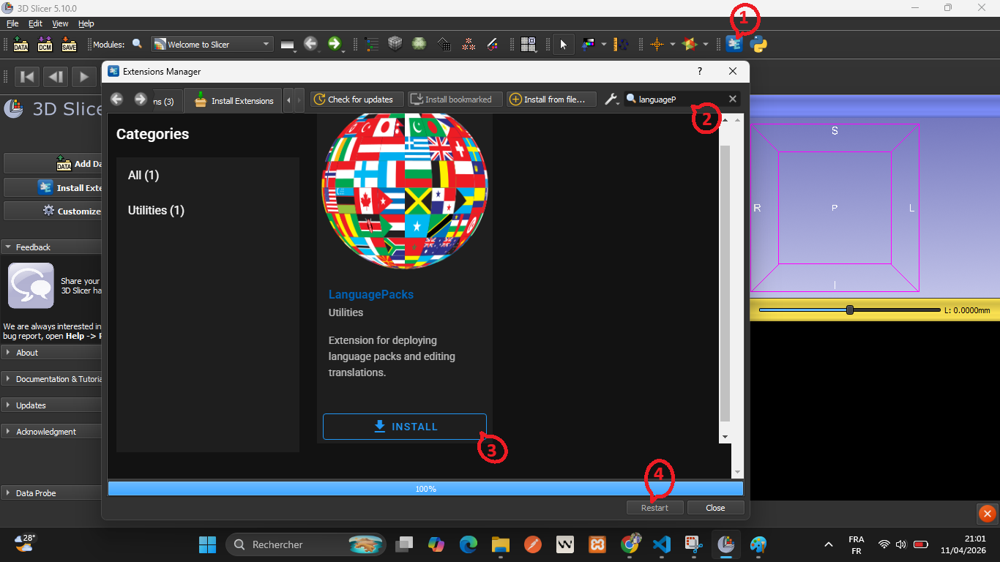
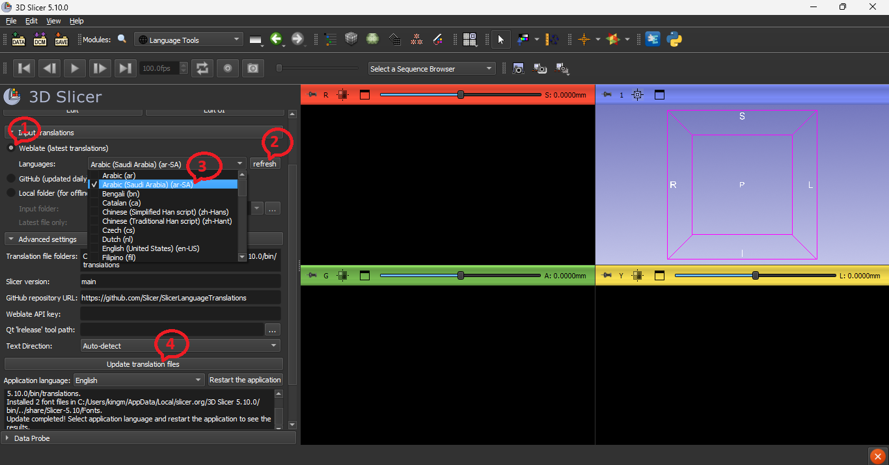
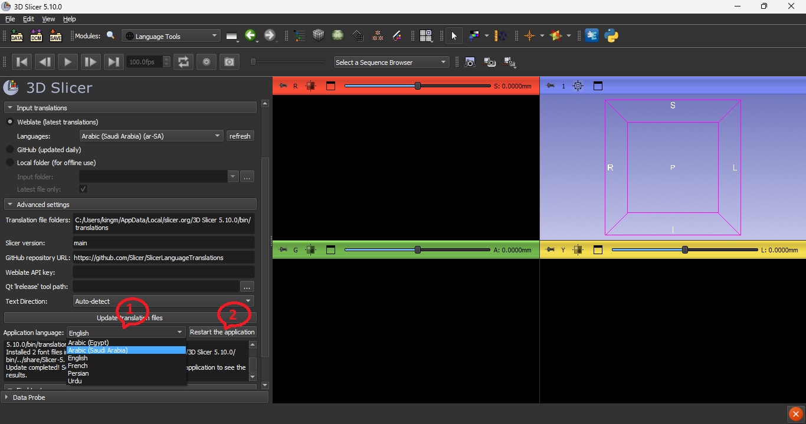
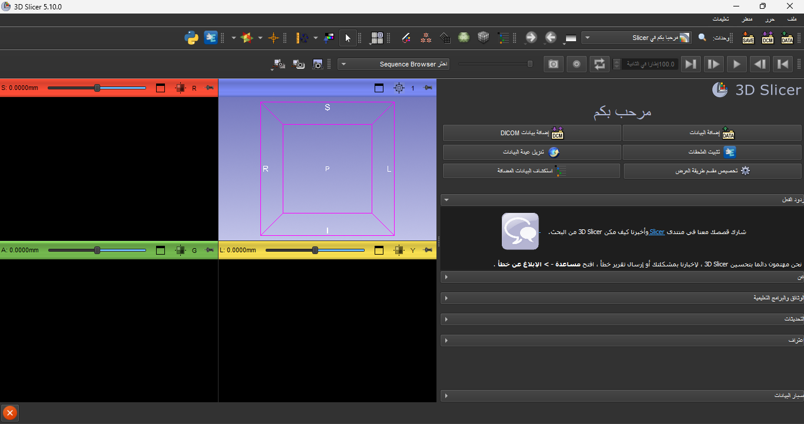

## كيفية الاستخدام

### الإعداد

  - [تنزيل](https://download.slicer.org) وتثبيت أحدث إصدار تجريبي من 3D Slicer (بتاريخ 23 نوفمبر 2025 أو أحدث)
  - تثبيت ملحق SlicerLanguagePacks. 
  - `1` : افتح `extension manager`
  - `2` : اكتب ”LanguagePacks“ في `search bar`
  - `3` : انقر على `Install`
  - `4` : انقر على `Restart`.
  

### تنزيل أحدث الترجمات وتثبيتها

- `1`: تنزيل أحدث الترجمات
  - الخيار أ: `Weblate`. قم بتنزيل اللغات المختارة مباشرةً من Slicer Weblate. يتيح ذلك الحصول على أحدث الترجمات، وهو أمر مفيد للمترجمين الذين يرغبون في اختبار تطبيقهم المترجم على الفور.
  - الخيار ب: `GitHub`. قم بتنزيل جميع اللغات من مستودع [SlicerLanguageTranslations](https://github.com/Slicer/SlicerLanguageTranslations). هذه هي أسرع طريقة للحصول على ملفات الترجمة المحدثة لجميع اللغات، ولكن يتم تحديث ملفات الترجمة هذه مرة واحدة فقط في اليوم.
- `2` : قم بتحديث قائمة اللغات بالنقر على زر `refresh` للاستعلام عن خادم Weblate.
- `3` : حدد اللغات التي سيتم تثبيتها في حقل `languages`.
- `4` : قم بترجمة ملفات الترجمة وتثبيتها في التطبيق بالنقر على زر `Update translation files`.

### ضبط لغة التطبيق

- اضبط لغة التطبيق في حقل `Application language`.
- انقر على زر  `Restart the application` لبدء استخدام ملفات الترجمة الجديدة في واجهة المستخدم.

يتوفر فيديو تعليمي يشرح الخطوات المختلفة [هنا](https://www.youtube.com/watch?v=8Omd_qQTJOk).
