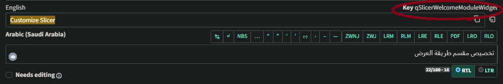
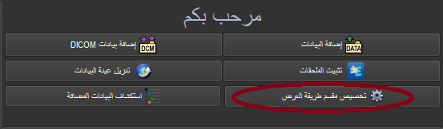
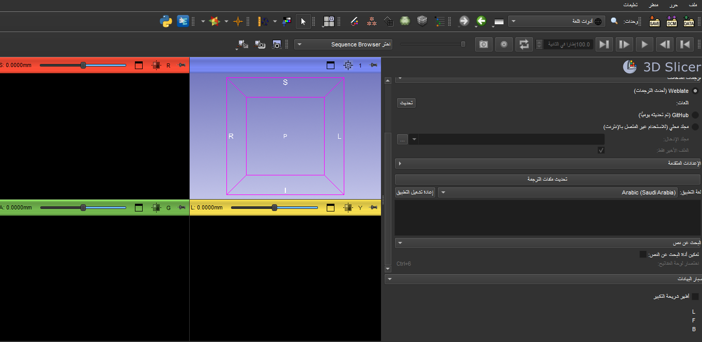

# إرشادات الترجمة

يهدف هذا المستند إلى تزويد المساهمين الجدد في الترجمة المجتمعية لبرنامج 3D Slicer على [Weblate](https://hosted.weblate.org/projects/3d-slicer/3d-slicer/) بنصائح حول كيفية المساعدة في ترجمة واجهة البرنامج بسهولة ودقة.

هذه الوثيقة قيد الإعداد. لا تتردد في اقتراح أي تعديلات عبر [GitHub "pull request"](https://docs.github.com/en/repositories/working-with-files/managing-files/editing-files).

## 1. البدء في استخدام Weblate

Weblate هي أداة ترجمة تعاونية مخصصة لمشاريع البرمجيات مفتوحة المصدر. وبمساعدة مساهمينا الرائعين، نسعى إلى ترجمة واجهة برنامج 3D Slicer بالكامل، من خلال جهد يعتمد بشكل أساسي على المجتمع. شكرًا لانضمامك إلينا!

يمكنك العثور على فيديو تعليمي حول كيفية إنشاء حساب على Weblate [هنا](https://youtu.be/LSvc9MmrxPA)

إذا قمت بإنشاء حساب باستخدام بريدك الإلكتروني واسم المستخدم، فستتلقى رسالة تأكيد عبر البريد الإلكتروني. افتح الرابط الموجود فيها واتبع التعليمات.

يُفضل استخدام حساب GitHub الخاص بك للوصول إلى Weblate. سيسمح ذلك لـ Weblate بمزامنة مشاريعك تلقائيًا مع مستودع GitHub المرتبط بها.

إذا قمت بتسجيل الدخول باستخدام GitHub، فسيتم توجيهك إلى صفحة GitHub حيث سيُطلب منك تأكيد منح Weblate حق الوصول إلى حساب GitHub الخاص بك. 

[هنا](https://github.com/SoniaPujolLab/SlicerLanguagePacks/blob/main/HowToUse_ar.md) رابط إلى دليل إرشادي حول كيفية تثبيت حزمة لغات Slicer وإعدادها لتمكين اللغات الأخرى في التطبيق.

**ملاحظة:** تأكد من تكرار خطوات `تحديث ملفات الترجمة` و`إعادة تشغيل التطبيق` بين الحين والآخر للحصول على أحدث الترجمات وأكثرها اكتمالاً، حيث قد تكون هناك مصطلحات جديدة تمت ترجمتها منذ آخر مرة استخدمت فيها Slicer.

## 2. تحديد موقع سلسلة نصية في واجهة المستخدم الرسومية لبرنامج Slicer

قد تظهر سلسلة نصية معينة في عدة مواضع مختلفة على واجهة المستخدم الرسومية لبرنامج Slicer، بل وأحيانًا في نفس الوحدة النمطية.  يمكن أن يؤثر موضع العنصر ووظيفته على الواجهة على معناه، وبالتالي على ترجمته. ولذلك، من المفيد معرفة هذه النصائح القليلة لتحديد العنصر الذي تقوم بترجمته بالضبط على Weblate في أي لحظة.

### مؤشر ”key“
في الزاوية اليمنى العليا من الترجمة على Weblate، ستلاحظ كلمة `Key` بالخط العريض، متبوعة بسلسلة نصية. يمكن أن تساعدك تلك السلسلة النصية في معرفة تقريبًا (وأحيانًا بدقة)  في أي وحدة أو نافذة من واجهة المستخدم الرسومية (GUI) يوجد المصطلح الذي تقوم بترجمته، كما هو موضح أدناه.

### البحث عن السلاسل غير المترجمة

قد يكون من المستحسن البدء بترجمة السلاسل الموجودة في واجهة المستخدم الرئيسية للتطبيق. ولتحقيق ذلك، أدخل مصطلح بحث يستبعد السلاسل الموجودة في وحدات CLI (وحدات واجهة سطر الأوامر): `NOT state:translated AND NOT (key:”CLI_“)`

### السلاسل المجاورة
كما ذكر أعلاه، قد يكون هناك عدة تكرارات لمصطلح ما في واجهة الوحدة النمطية نفسها. في هذه الحالة، قد يكون من المفيد الاعتماد على العناصر المحيطة بالعنصر الذي تقوم بترجمته. يقوم Weblate بإقران كل سلسلة بقائمة من السلاسل الموجودة مباشرة قبل أو بعد العنصر في كود واجهة المستخدم الرسومية.

### ”موقع السلسلة المصدرية“
يمكن أن تساعدك علامة `موقع السلسلة المصدرية` في Weblate على التعمق أكثر والعثور بالضبط على **السطر الذي يحتوي على السلسلة** التي تقوم بترجمتها حاليًا. ويمكن العثور عليها في مربع `معلومات السلسلة` في أسفل اليمين.

*(السبب في عدم تطابق أرقام الأسطر في هذا المثال بالتحديد هو أن الكود قد تم تحديثه في الفترة الفاصلة بين وقت تحميل ملفات الترجمة والوقت الحالي)*

## 3. ترجمة النص

### العناصر النائبة والأحرف الخاصة

يكون النص الأصلي في الغالب نصًا عاديًا، ولكن هناك بعض الأحرف الخاصة والقواعد التي تستخدمها أدوات الترجمة الشائعة في Qt وPython. فيما يلي ملخص موجز:

- تُستخدم العناصر النائبة للنص الذي يتم استبداله بأسماء أو أرقام محددة عند استخدام التطبيق. يمكن أن تظهر العناصر النائبة على شكل `%1`، `%2`، ... (نمط Qt) أو على شكل `{some_name}`، `{some_number}` (نمط Python) في النص المصدر. يجب عدم ترجمة العناصر النائبة بل إبقائها دون تغيير في النص المترجم.
- يتم تحديد اختصارات لوحة المفاتيح بواسطة البادئة `&` داخل سلسلة (نمط Qt). على سبيل المثال، سيجعل `&New file` الحرف `N` اختصارًا للوحة المفاتيح. يوصى بالحفاظ على اختصارات لوحة المفاتيح. نظرًا لأن الحرف `&` الفردي يشير إلى اختصار لوحة المفاتيح، يجب استخدام `&&` لوضع حرف العلامة التجارية في النص.

أمثلة:

- النص الأصلي: `تعذر تسجيل الوحدة النمطية {name}`
  - ترجمة صحيحة: `A {name} modult nen lehetett regisztralni`
  - ترجمة خاطئة: `A {nev} modult nen lehetett regisztralni` (تم تعديل العنصر النائب `name` إلى `nev`)
- النص الأصلي: `تم تصدير العنصر %1 بنجاح إلى %2`
  - ترجمة جيدة: `تم حفظ العنصر %1 بنجاح في %2`
  - ترجمة جيدة: `تم حفظ العنصر %1 في %2` (يمكن تغيير ترتيب العناصر النائبة في النص المترجم)
  - ترجمة سيئة: `تم حفظ العنصر %1 بنجاح` (العنصر النائب `%2` مفقود)
- النص الأصلي: `إنشاء &ملف جديد`
  - ترجمة جيدة: `Keszitsen &Uj Fajlt`
  - ترجمة سيئة: `Keszitsen Uj Fajlt` (تعمل، لكن اختصار لوحة المفاتيح لم يعد متاحًا لهذا الزر أو عنصر القائمة)
- النص الأصلي: `مساعدة && شكر وتقدير`
  - ترجمة جيدة: `Segitseg && Koszonetnyilvanitas`
  - ترجمة جيدة: `Segitseg es Koszonetnyilvanitas` (ليس من الضروري استخدام علامة العطف إذا لم تكن شائعة الاستخدام في اللغة الهدف)
  - ترجمة سيئة: `Segitseg & Koszonetnyilvanitas` (سيتم تفسير علامة العطف المفردة على أنها اختصار لوحة مفاتيح)

### ترجمة المصطلحات الصعبة

في واجهة برنامج 3D Slicer المعقدة، قد يكون لبعض المصطلحات معانٍ مرتبطة بالسياق بشكل وثيق، ومن المحتمل أن تفقد دقتها إذا لم تُترجم بعناية. يمكن أن يساعد تحديد موقع السلسلة في الواجهة أو استخدام العنصر الذي تشير إليه في فهم التعريف الدقيق للمصطلح بشكل أفضل، وبالتالي ترجمته بأكبر قدر ممكن من الدقة.
هناك طريقة أخرى لضمان أعلى جودة للترجمة وهي الاستفادة من النهج المجتمعي الذي تستند إليه عملية التدويل لدينا.

#### زر `Suggest`
عند ترجمة سلسلة نصية على Weblate، لديك خيار إرسال ترجمتك والانتقال إلى العنصر التالي، أو إرسال ترجمتك والبقاء على نفس الصفحة، أو إرسال ترجمتك كاقتراح.

 

 عندما تختار الخيار الثاني، يتم تمييز الاختلافات بين ترجمتك والترجمة الحالية باللون الأخضر، بينما يتم شطب الأجزاء التي تحل محلها وتمييزها باللون الأحمر، كما هو موضح أدناه.
 
 

يمكن بعد ذلك الموافقة على الاقتراح أو تعديله أو رفضه من قِبلك أو من قِبل مستخدم آخر أو من قِبل مدقق لغوي معين.

 

يُعد هذا الخيار مفيدًا في حالة عدم تأكدك من الترجمة التي أرسلتها، ورغبتك في أخذ الوقت الكافي لفهم المصطلح بشكل أفضل قبل تأكيده، أو رغبتك في الحصول على رأي ثانٍ من مستخدمين آخرين.

#### قسم التعليقات
يوفر Weblate أيضًا إمكانية ترك تعليق على صفحة ترجمة السلسلة. يتيح لك ذلك التفاعل مع المساهمين الآخرين في لغتك وبدء محادثة حول فهم كل منكم للمصطلح والاتفاق في النهاية على معنى وترجمة مشتركة.

 

لضمان مواكبتك للمناقشات المتعلقة بالمشروع، يمكنك تحديث إعداداتك لتتلقى إشعارًا عند نشر تعليق جديد؛ وفي حال أصبحت الإشعارات كثيرة جدًّا، يمكنك دائمًا تعديلها بما يناسبك.
على سبيل المثال: في حين يتعين إخطار المراجع المكلف بجميع تحديثات المناقشة، يمكنك اختيار ضبط Weblate بحيث يُعلمك فقط بالتعليقات المتعلقة بالترجمات التي قمت بإرسالها أو تلك التي تمت الإشارة إليك فيها.

 

يمكنك تغيير إعدادات الإشعارات [هنا](https://hosted.weblate.org/accounts/profile/#notifications).

#### العبارات غير القابلة للترجمة
يجب عدم ترجمة أي عبارة تبدأ بـ `vtk` أو `MRML`، بل يجب الإبلاغ عنها كأخطاء في تقارير أخطاء Slicer. 

**مثال:**

يمكنك أيضًا تمييزها بعلامة `read-only` (اقرأ المزيد عن علامات Weblate [هنا])(https://docs.weblate.org/en/latest/admin/checks.html#customizing-behavior-using-flags)

## 4. التحقق من صحة الترجمة

هناك عدة طرق للإشارة إلى أن الترجمة تحتاج إلى مراجعة. وأكثر الطرق شيوعًا بين المساهمين لدينا هي مربع الاختيار `needs editing` وميزة `suggest`.  

## 5. الأسلوب

لضمان اتساق الأسلوب، من المهم أن يستخدم جميع المترجمين لنفس اللغة نفس الإرشادات. يتوفر دليل أسلوب مفصل لمعظم اللغات على [موقع Microsoft](https://www.microsoft.com/en-us/language/StyleGuides). إذا اتفق المترجمون على استخدام دليل أسلوب معين، فيكفيهم فقط توفير رابط تنزيل لهذا الدليل وتوثيق أي اختلافات يرغبون في إدخالها على تلك الإرشادات.

## 6. مصطلحات المسرد

تُستخدم بعض الكلمات الإنجليزية في Slicer بمعنى محدد للغاية. على سبيل المثال، تشير كلمة `volume` إلى صورة ثلاثية الأبعاد.
بعض هذه الكلمات مدرجة في [مسرد Slicer].(https://slicer.readthedocs.io/en/latest/user_guide/getting_started.html#glossary).

عند ترجمة هذه الكلمات إلى لغة أخرى، غالبًا ما يكون من الأفضل عدم ترجمتها حرفيًا،
بل البحث عن كلمة تصف المعنى الفعلي بشكل أفضل، وترجمة تلك الكلمة. على سبيل المثال، بدلاً من ترجمة
`volume`، من الأفضل ترجمة كلمة `image`.

إذا صادفت كلمة يبدو من المنطقي ترجمتها استنادًا إلى كلمة إنجليزية مختلفة، يرجى إضافتها إلى المسرد على weblate
بالنقر على رابط `إضافة مصطلح إلى المسرد` على الجانب الأيمن من الشاشة ووصف الكلمة المستخدمة بإضافة إلى الشرح: `ترجم كـ “شيء ما”`.
انظر على سبيل المثال مصطلح `glyph`: https://hosted.weblate.org/translate/3d-slicer/glossary/en/?checksum=d948d4a61ccd080a

يحتوي كل مشروع على Weblate على **مسرد** مرتبط به. وهو عبارة عن مجموعة من المصطلحات، التي عادةً ما تكون معقدة المعنى أو محددة جدًا في نطاق المشروع، مما يتطلب تعريفًا شاملاً وأحيانًا توضيحات إضافية حول معنى السلسلة واستخدامها. ثم يتم ربط العناصر المدرجة في المسرد بالسلاسل التي تحتوي عليها، في مكون الترجمة الرئيسي (عندما تحتوي سلسلة على مصطلح من المسرد، سيكون هناك إشارة إلى المصطلح على يمين الواجهة في لوحة بعنوان `Glossary`). يمكن أن يكون هذا مفيدًا في ترجمة المصطلحات الصعبة نسبيًا من الواجهة.

لن تحتوي لوحة `المصطلحات` على أي معلومات في حالة وجود مصطلح أو سلسلة نصية غير موجودة في قائمة المصطلحات. ومع ذلك، إذا كان المصطلح مذكورًا في قائمة المصطلحات، فستظهر لك `ترجمة` مقترحة بالإضافة إلى `شرح` للمصطلح. يمكنك الاعتماد على هذا الشرح للتأكد من فهمك للمصطلح بشكل أفضل، وبالتالي تقديم الترجمة الأكثر دقةً ممكنة.

يرجى ملاحظة أن `الشرح` متاح باللغة الإنجليزية فقط. 

للعثور على ترجمة جيدة للمصطلحات الحاسوبية العامة، يمكنك استخدام [وظيفة البحث عن المصطلحات من Microsoft](https://www.microsoft.com/en-us/language/Search).

## 7. أداة ”البحث عن نص“ في ملحق حزم اللغات
 
 لاستخدام ميزة `البحث عن نص`، اتبع الخطوات التالية:
 
  - `1`: حدد `تمكين أداة البحث عن النص` في قسم `البحث عن نص` بملحق حزم اللغات.
  
  
  
  - `2` :  لتنشيط خيار `تمكين أداة البحث عن النص`، حدد وحدة `Slicer` واضغط على `Ctrl+6` أو `Ctrl+Shift+6` في نظام `Windows`، و`Command+6` في نظام  `Mac` على أي سلسلة نصية في واجهة المستخدم.
  
  
  
  - `3` : انقر على `إضافة بيانات DICOM` لتحديد موقع السلسلة في مستودع Slicer Weblate.
  - `4` : حدد `exact match`
  
  
  
  - `5` : سيأخذك الرابط إلى موقع السلاسل في مستودع Slicer Weblate. 
  

لمزيد من التوضيح، يمكنك مشاهدة فيديو توضيحي [هنا](https://www.youtube.com/watch?v=td-KHzdrko8)
